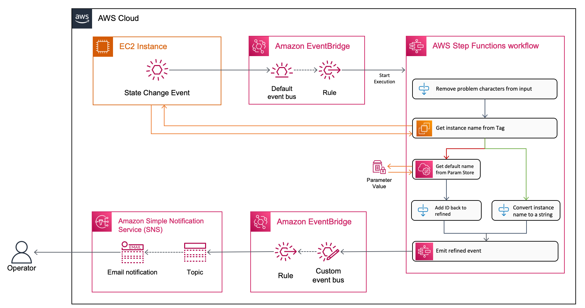

# Serverless Event Enrichment

This example code shows a method of using AWS Serverless services to take an operational lifecycle event emitted from [EC2](https://aws.amazon.com/ec2/) - Shutdown, Reboot, etc - and enrich it with additional information from elsewhere.

The Serverless application here will attempt to obtain the value of the EC2 instance's "Name" tag if one is present, and add it to the event payload. The purpose of this is that when this enriched event is consumed by a downstream system, context has been added so that more meaningful actions and reporting can take place.

In your context, you can modify and extend this idea to enrich any operational events from any source that publishes to [Amazon EventBridge](https://aws.amazon.com/eventbridge/) and enrich and transform that event with data from any accessible source.

## Architecture



There is a [full blog post](linkTBD) that explains this architecture and application in full detail. The post uses an example of an SNS notification (seen in the diagram above), and this code uses CloudWatch Logs as the destination for the enriched event. In both cases the principles are the same.

1. An EC2 instance emmits an operational lifecycle event and this is sent to your Default event bus on Amazon EventBridge.
2. If the event matches the deployed EventBridge Rule then EventBridge passes the event's payload to a Step Functions state machine.
3. The State Machine runs through a series of steps where it:  
   a. transforms the event payload to remove any invalid characters  
   b. a native SDK integration calls the EC2 service API and collects all tags from the instance  
   c. if tags are returned, then all tags apart from the "Name" tag are discarded, and the value of the "Name" tag is added to the event to enrich it  
   d. if no tags are found, an arbitrary default name is obtained from a value stored in Parameter Store as part of this sample code  
   e. lastly, the enriched event is emitted to your custom application event bus (deployed as part of this sample).
4. If the enriched event matched the deployed EventBridge Rule for enriched events then EventBridge will log the event payload to CloudWatch Logs.

#### Services and concepts

- [Amazon EventBridge](https://aws.amazon.com/eventbridge/)
  - [EventBridge Rule](https://docs.aws.amazon.com/eventbridge/latest/userguide/eb-rules.html)
  - [EventBridge Target](https://docs.aws.amazon.com/eventbridge/latest/userguide/eb-targets.html)
- [AWS Step Functions](https://aws.amazon.com/step-functions/)
  - [Step Functions SDK Integrations](https://docs.aws.amazon.com/step-functions/latest/dg/supported-services-awssdk.html)
  - [Amazon States Language](https://docs.aws.amazon.com/step-functions/latest/dg/concepts-amazon-states-language.html) (ASL)
- [JSONPath ](https://goessner.net/articles/JsonPath/) (external reference)

---

## Using this sample

This section shows how to Deploy, Experiment with, and Cleanup (remove) the sample from your AWS account.

### Deploy the sample application

The example here uses the Serverless Application Model (AWS SAM) and you will need to use the SAM Command Line Interface (SAM CLI) to deploy the sample.

These instructions assume you have:

- an appropriate AWS account to use
- sufficient IAM privileges to create new resources & IAM principals
- the AWS CLI installed and configured with your IAM profile: [installing](https://docs.aws.amazon.com/cli/latest/userguide/getting-started-install.html) | [configuring](https://docs.aws.amazon.com/cli/latest/userguide/cli-chap-configure.html)
- SAM CLI installed: [installing](https://docs.aws.amazon.com/serverless-application-model/latest/developerguide/serverless-sam-cli-install.html)

> The components used in this example are all eligible for the AWS Free Tier, but you are responsible for any costs incurred in your AWS account.

Once all pre-requisites have been satisfied and you have cloned this GitHub repository then in your terminal run the following commands to first build, and then perform a guided deployment.

```bash
sam build
sam deploy --guided
```

This command will deploy the sample to your AWS account, with a series of prompts. Other than providing a name for the stack, you can accept all of the other defaults:

- **Stack Name**: The name of the stack to deploy to CloudFormation. This should be unique to your account and region, and a good starting point would be something matching your project name. In this context, I will use `serverless-event-enrichment`.
- **AWS Region**: The AWS region you want to deploy your app to. For example **eu-west-1** for Ireland, **eu-west-2** for London. ([See full list](https://docs.aws.amazon.com/AmazonRDS/latest/UserGuide/Concepts.RegionsAndAvailabilityZones.html))
- **Confirm changes before deploy**: If set to yes, any change sets will be shown to you before execution for manual review. If set to no, the AWS SAM CLI will automatically deploy application changes.
- **Allow SAM CLI IAM role creation**: Many AWS SAM templates, including this example, create AWS IAM roles required for the sample to access AWS services and resources. By default, these are scoped down to minimum required permissions. To deploy an AWS CloudFormation stack which creates or modifies IAM roles, the `CAPABILITY_IAM` value for `capabilities` must be provided. If permission isn't provided through this prompt, to deploy this example you must explicitly pass `--capabilities CAPABILITY_IAM` to the `sam deploy` command.
- **Save arguments to samconfig.toml**: If set to yes, your choices will be saved to a configuration file inside the project, so that in the future you can just re-run `sam deploy` without parameters to deploy changes to your application.

### Experiment

To see the effect of this example in action you will need an EC2 instance. If you already have one then skip ahead, if you don't already have one then you can create one in the EC2 AWS console by following **Step 1: Launch an instance** from [these instructions](https://docs.aws.amazon.com/AWSEC2/latest/UserGuide/EC2_GetStarted.html). Be sure to provide a value for the "Name" tag.

Now that you have an EC2 instance:

1. In the [EC2 Console](https://console.aws.amazon.com/ec2) make sure you're in the same region that you selected while using the `sam deploy --guided` command.
2. Check the box next to your EC2 instance that you wish to test with.
3. Click **Instance state** near the top of your window and select **Start** or **Stop**.

> The current state of your EC2 instance will dictate which actions are available to you.

In the Output from the `sam deploy` command there are 2 links. Following the CloudWatch Logs link will let you see the enriched event with the "Name" tag from the instance alongside the original EC2 event payload. The Step Functions link will allow you to open the execution that took place and visually see what happened at each step.

### Cleanup

Once you have completed your experimentation you may delete this sample. To delete the sample application that you created, use the SAM CLI again by running:

```bash
sam delete
```

If you accidentally deleted your local working folder, preventing SAM CLI from detecting the deployed example then you may use the AWS CLI:

```bash
aws cloudformation delete-stack --stack-name serverless-event-enrichment
```

> If you used a different stack name, substitute yours in.

## Further Resources

See the [AWS SAM developer guide](https://docs.aws.amazon.com/serverless-application-model/latest/developerguide/what-is-sam.html) for an introduction to SAM specification, the SAM CLI, and serverless application concepts.

Visit [ServerlessLand.com](https://serverlessland.com) to learn more about AWS Serverless with links to blogs, patterns, examples, sample workflows and more.

## Files in Repository

```
├─ README.md (this file)
├─ architecture.png (architecture diagram)
├─ samconfig.toml (created by SAM when you first run with --guided)
├─ template.yaml (the SAM cloudformation definition of the app)
├─ statemachine
│  └─ event-enrichment-sfn.asl.json (the ASL YAML defining the state machine)
```
